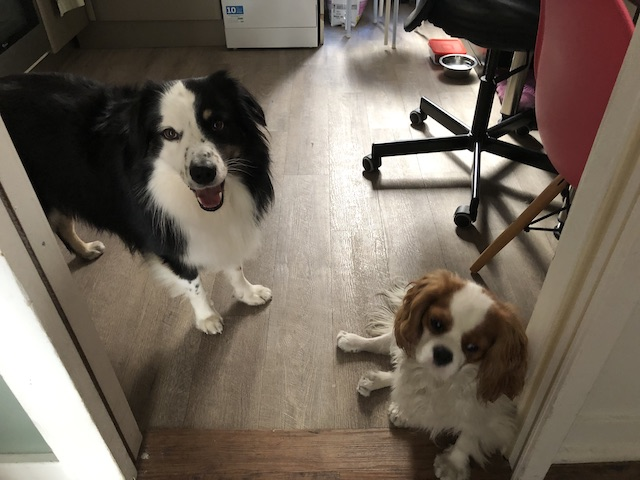
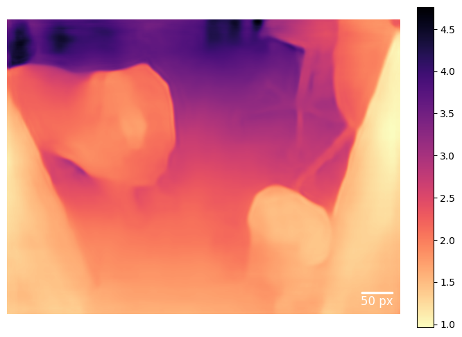

# DINOv2_medium_article
Repository for DINOv2 and Barlow twin as a practise exercise project

## Install the following for the DinoV2

```
pip install -r requirements.txt
```

```
pip install -r requirements-extras.txt
```

```
pip install xformers
```

```
pip install torchvision
```

```
pip install matplotlib-scalebar
```

## DINOv2 github
```
REPO_URL = "https://github.com/facebookresearch/dinov2"
    !{sys.executable} -m pip install -e {REPO_URL}'[extras
```

# Depth Estimation example

